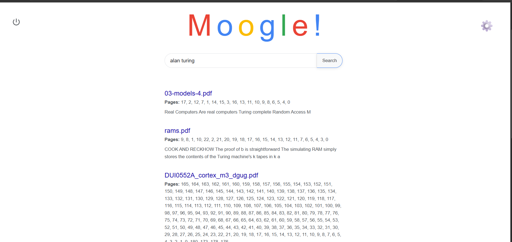
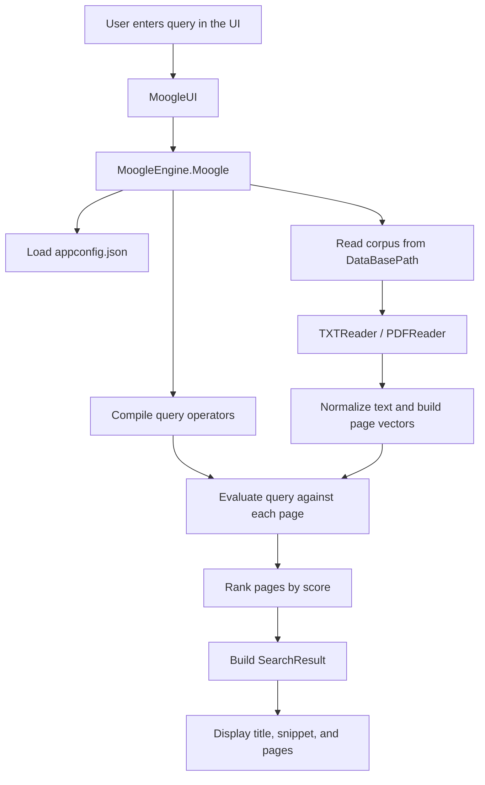
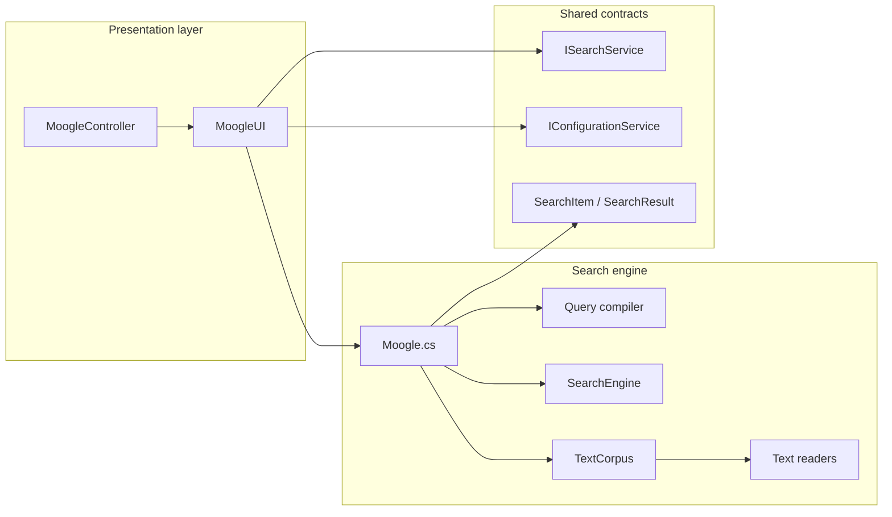
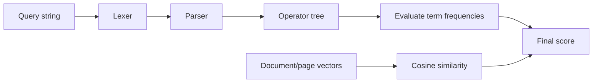

# Moogle!



> Programming I project.  
> Faculty of Mathematics and Computer Science - University of Havana.  
> Courses 2021, 2022.

Moogle! is an offline search engine developed in C# with a Blazor web interface. It indexes documents from a configurable folder and lets you search them using relevance ranking, query operators, and context snippets.

## Features

- Search across **.txt** and **.pdf** files.
- Recursive scan of the configured documents folder.
- Ranking based on a **vector-space model** with cosine similarity.
- Query weighting through operators:
  - `^word` → the word must exist.
  - `!word` → the word must not exist.
  - `*word` → boosts the importance of the word in the query.
- Context snippets for each result.
- Configurable data directory and number of results shown.
- Caching of the last query to avoid recomputing the same search.

## Query syntax

Queries can include plain words and operators.

### Operators

- `^word`: document where `word` exists.
- `!word`: document where `word` does not exist.
- `*word`: gives more relevance to `word`.

### Examples

- `algorithms sorting`
- `^pdf !image`
- `*programming ^csharp`
- `!noise *relevance`
- `*^query` is also processed by the operator compiler.

## Installation & Running

### Requirements

- **.NET 8.0** or later
- A folder containing `.txt` and/or `.pdf` documents to search

### Setup Steps

1. **Clone the repository**
   ```bash
   git clone https://github.com/crackbandicoot-dot/Moogle.git
   cd Moogle
   ```

2. **Configure your documents folder(or edit on the GUI)**
   - Open or create `appconfig.json` in the root directory
   - Set the `DataBasePath` to point to your documents folder
   - Example:
     ```json
     {
       "DataBasePath": "./documents",
       "MaxResultsCount": 10
     }
     ```

3. **Run the application**
   
   Using the included script:
   ```bash
   ./run.sh  # On Linux/macOS
   # or
   run.bat   # On Windows
   ```

   Or run directly with .NET:
   ```bash
   dotnet run --project MoogleUI
   ```

4. **Access the search engine**
   - The application will start the Blazor web interface
   - Open your browser to the displayed URL (typically `http://localhost:5000`)
   - Start searching your documents!

### Quick Example

Once running:
1. Enter a search query like `algorithms` to find all documents containing that word
2. Use operators like `^required !exclude *important` to refine your search
3. Click on results to view the matched content and snippets

## How it works

The search flow is:

1. Load configuration from `appconfig.json`.
2. Read the documents from the configured directory.
3. Extract and normalize the text from each page or file.
4. Vectorize the corpus.
5. Compile the query into an operator expression.
6. Compute a score for each page by combining:
   - similarity between the query vector and the document vector;
   - operator evaluation over word frequencies.
7. Return the results with title, snippet, and relevant pages.



## Architecture overview




## Supported formats

Moogle reads documents with these extensions:

- `.txt`
- `.pdf`

PDFs are processed page by page using **PdfPig**.

## Ranking model

The ranking combines two ideas:

- **Cosine similarity** between the query vector and the document vector.
- **Operator evaluation** over term frequencies on each page.

In practice, this favors documents with more relevant terms and filters out documents that do not satisfy the query operators.



## Project structure

- `MoogleEngine/` → search logic, document reading, and ranking.
- `MoogleUI/` → web interface.
- `MoogleController/` → desktop controller to start and stop the UI.
- `Shared/` → shared interfaces and models.

## Note

The original README image is kept for now.
